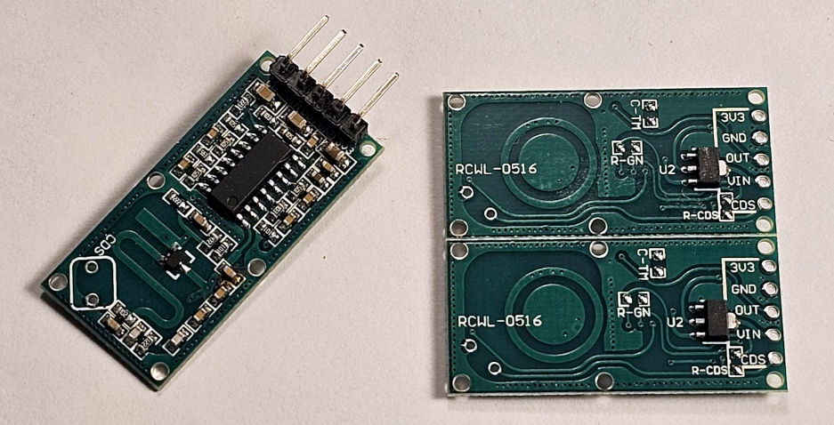

# Toit Library for RCWL0516 Doppler Microwave Radar sensor




> [!WARNING]
> The 3v3 Pin is for outputting 3v3 voltage.  It is not for powering the board.
> The board is 4-28v only.

## Features:
- **Type:** Microwave motion detector (not PIR).
- **IC:** Usually based on the RCWL-0516 chip itself (on the board).
- **Frequency:** ~3.18 GHz (in the ISM band).
- **Sensing principle:** Doppler radar — it measures phase changes in the
  reflected microwaves caused by moving objects.
- **Typical detection range:** 5–7 m (can reach 9 m in open air), although my
  board didn't get anywhere near this powered by 5v.
- **Detection angle:** ~360° in free space, roughly 100–120° through walls
  depending on material.
- **Output:** Digital high (3.3 V) when motion is detected.  Signal is either
  high or low, does not emit other signals that could be interpreted to distance
  etc.
- **Supply:** 4 – 28 V DC (regulator onboard; outputs are 3.3 V logic).
- **On-board regulator:** AMS1117-3.3 (so you can power from 5 V without issue).

## Pins
| Pin |	Function | Notes |
| - | - | - |
| 3V3 | Regulated output from onboard regulator. | Don’t feed power here.|
| GND | Ground | Common with MCU GND|
| OUT | Output signal -m3.3 V HIGH when motion detected | Connect to MCU input|
| VIN | Power input (4 – 28 V) | Can use ESP32’s 5 V pin|
| CDS | Light sensor enable (optional) | Connect to LDR to disable detection in light |

## Driver:
Driver simply runs a task to call a callback when the sensor is tripped.  (Could
also be used for any other binary type output sensor.)  See the s folder for the
best worked example.  In fact the device is so simple, it doesn't really need
a microcontroller to operate.  This can be demonstrated using the OUT pin, an
LED and corresponding resistor.
```Toit
// Basic Setup Omitted

// Start up the motion detection on pin 26:
print "Starting Motion Detection..."
rcwl0516-driver := Rwcl0516 26

// Have the motion detection events turn the LED on or off.
// Clear callback won't fire until movement event completely clears (eg movement
// detection stops for the required 2s timeframe).
rcwl0516-driver.set-callback --movement=:: led-pin.set 1
rcwl0516-driver.set-callback --clear=:: led-pin.set 0

// Run a loop and print something if the board shows a movement event.
// Note that in this case it latches, and clears after the function is called.
// Will not return true until a NEW motion detection event fires.
while true:
  if rcwl0516-driver.motion-detected:
    print "Motion Detected..."
  sleep --ms=250
```

## Issues
If there are any issues, changes, or any other kind of feedback, please
[raise an issue](https://github.com/milkmansson/toit-rcwl0516/issues). Feedback is welcome and appreciated!

## Disclaimer
- This driver has been written and tested with the pictured module.  Others
  exist with different pads and functions on the back.
- All trademarks belong to their respective owners.
- No warranties for this work, express or implied.

## Credits
- These works were pivotal in understanding the device and how it works.
  - https://randomnerdtutorials.com/arduino-rcwl-0516/
  - https://github.com/jdesbonnet/RCWL-0516
- [Florian](https://github.com/floitsch) for the tireless help and encouragement
- The wider Toit developer team (past and present) for a truly excellent product
- AI has been used for code and text reviews, analysing and compiling data and
  results, and assisting with ensuring accuracy.

## About Toit
One would assume you are here because you know what Toit is.  If you dont:
> Toit is a high-level, memory-safe language, with container/VM technology built
> specifically for microcontrollers (not a desktop language port). It gives fast
> iteration (live reloads over Wi-Fi in seconds), robust serviceability, and
> performance that’s far closer to C than typical scripting options on the
> ESP32. [[link](https://toitlang.org/)]
- [Review on Soracom](https://soracom.io/blog/internet-of-microcontrollers-made-easy-with-toit-x-soracom/)
- [Review on eeJournal](https://www.eejournal.com/article/its-time-to-get-toit)
